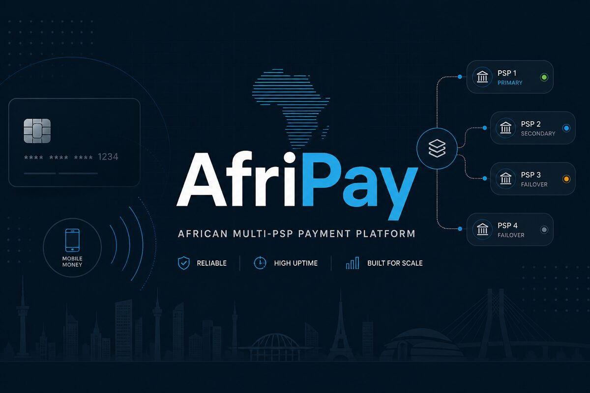
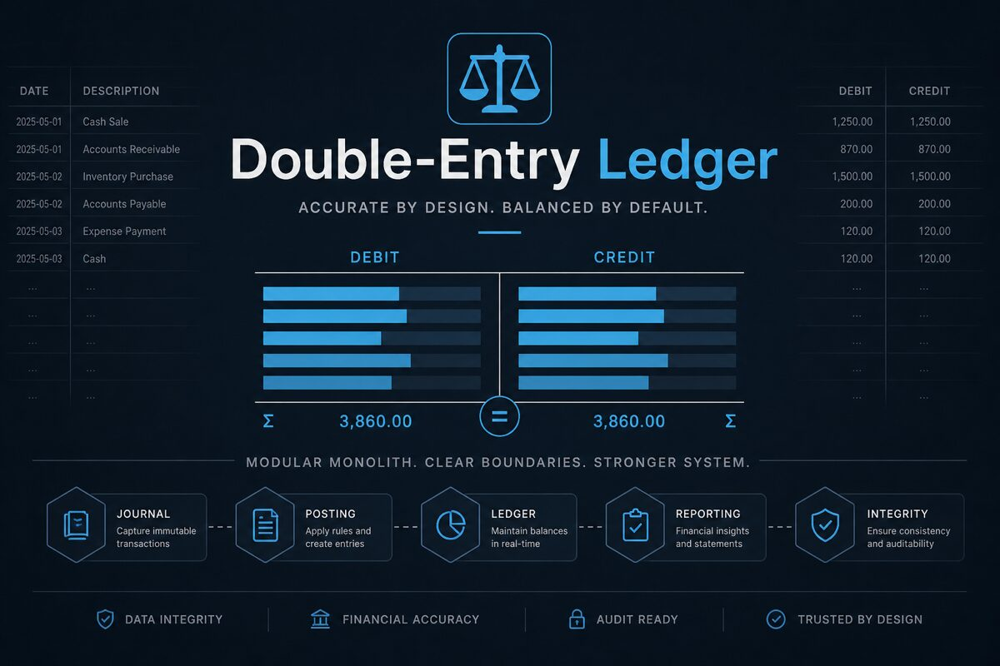
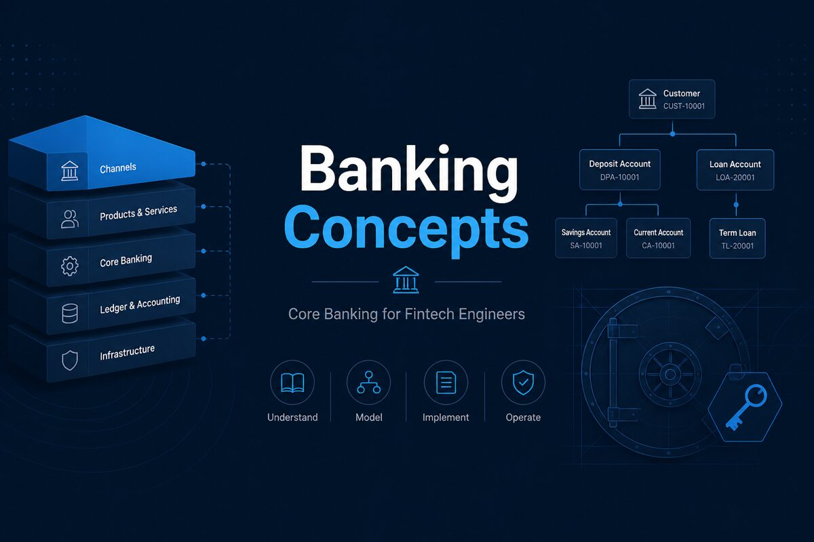
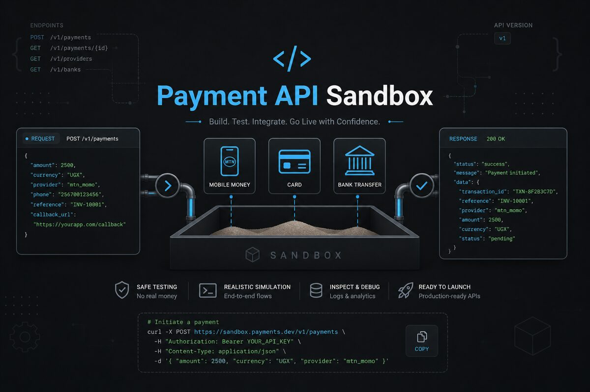

<!-- https://github.com/saifcores · https://saifcore.vercel.app -->

**Senior Backend Engineer** building payment and banking platforms that stay correct under failure.

Dakar (GMT) · Remote worldwide · FR / EN

  
  
  
  
  

---

### Profile

I design and ship **Java / Spring Boot** backends for **fintech, payments, and banking** — APIs, ledgers, and integrations where money movement, auditability, and uptime are the product.

Recent delivery includes enterprise banking platforms for **Bank of Africa Group** (via Synapse), fintech payment systems at **ENG Technologie**, and SaaS backends across West Africa.

|                  |                                                                               |
| ---------------- | ----------------------------------------------------------------------------- |
| **Domain**       | Payments · Core banking concepts · Multi-tenant SaaS                          |
| **Systems**      | Transactional APIs · Double-entry ledgers · PSP adapters · Event-driven flows |
| **Platform**     | Docker · Kubernetes · AWS · CI/CD                                             |
| **Ask me about** | Idempotency · reconciliation · service boundaries · failure isolation         |

→ Full case studies & engagement packages: **[saifcore.tech](https://saifcore.**tech**)**

---

### Featured projects

<table>
  <tr>
    <td width="50%" valign="top">
      
       
      <b><a href="https://github.com/saifcores/afripay">AfriPay</a></b> 
      Multi-PSP payment backend — mobile money, cards, wallets, ledger & failover
    </td>
    <td width="50%" valign="top">
      
       
      <b><a href="https://github.com/saifcores/double-entry-ledger-platform">Double-Entry Ledger</a></b> 
      Modular monolith for wallets & accounting-correct money movement
    </td>
  </tr>
  <tr>
    <td width="50%" valign="top">
      
       
      <b><a href="https://github.com/saifcores/banking-concepts-for-fintech-developers">Banking Concepts</a></b> 
      Core banking models for fintech engineers (T24 / Flexcube / Mambu-style)
    </td>
    <td width="50%" valign="top">
      
       
      <b><a href="https://github.com/saifcores/payment-api-sandbox">Payment API Sandbox</a></b> 
      Fintech sandbox for Mobile Money, card & bank API integration testing
    </td>
  </tr>
</table>

---

### Stack

  

---

### Activity

  
  
   
  

****
---

### Principles

1. **Own the failure mode** — design for the page you’ll get at 2am  
2. **Boring tech wins** — novelty only when it cuts real risk or cost  
3. **Trade-offs in writing** — consistency, latency, coupling — made explicit  
4. **Handoff-ready** — interfaces and observability the next team can run  

---

**Open to** senior backend roles · contract · freelance  
Fintech · banking platforms · distributed systems

  
  

